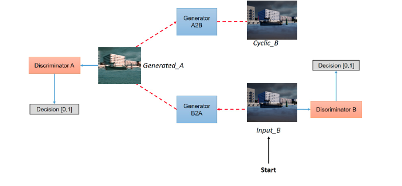

# Conducting Comprehensive Training and Validation Tests with Maritime Dataset and Fine-Tuned Hyperparameters for [CycleGAN](https://github.com/junyanz/pytorch-CycleGAN-and-pix2pix)

Explore an all-in-one Colab notebook to reproduce my results using the pre-trained model: [](https://colab.research.google.com/drive/1gn4E-sGde88apPNuxCiONjOaJJ1FrIU7?usp=sharing)

If you wish to conduct your experiments using maritime data with fine-tuned hyperparameters, please continue reading.

## Overview of CycleGAN

CycleGAN, or Cycle-Consistent Generative Adversarial Network, is a deep learning model designed for image-to-image translation. Developed in 2017 by researchers at the University of California, Berkeley, CycleGAN's primary objective is to learn mappings between two domains without the need for paired training data. The implementation can be found [here](https://github.com/junyanz/pytorch-CycleGAN-and-pix2pix).

<details>
  <summary>(Click to Expand) <strong>Key Components and Concepts Associated with CycleGAN:</strong></summary>

1. **Generative Adversarial Networks (GANs):** CycleGAN builds upon the foundation of GANs. This architecture consists of a generator and a discriminator network trained simultaneously through adversarial training. The generator creates realistic-looking data, while the discriminator distinguishes between real and generated data.

2. **Cycle-Consistency:** A distinctive feature of CycleGAN is its emphasis on cycle-consistency. In image translation tasks, cycle-consistency ensures that if an image from domain A is translated to domain B and then back to domain A, it should resemble the original image. This constraint is enforced during training to improve the quality of generated images.

3. **Unpaired Image Translation:** Unlike many other image translation models requiring paired training data, CycleGAN can learn mappings between domains without such pairs. This makes it particularly useful in scenarios where obtaining paired data is challenging or impractical.

4. **Loss Functions:** CycleGAN uses multiple loss functions for effective model training. The adversarial loss encourages the generator to create realistic images, and the cycle-consistency loss enforces consistency between the original and reconstructed images after translation.

5. **Applications:** CycleGAN has been successfully applied to various image translation tasks, such as turning photographs into paintings, converting satellite images to maps, transforming horses into zebras, and more. Its versatility and ability to handle unpaired data make it suitable for a wide range of domains.

</details>

## Overview of Datasets Used in This Experiment

In this experiment, we leveraged two public datasets within the Maritime domain:

1. **Domain A (Photorealistic Data):** [The Split Port Ship Classification Dataset (SPSCD)](https://labs.pfst.hr/maritime-dataset/)
2. **Domain B (Simulated):** [A High Resolution Simulation Dataset for Ship Detection with Precise Annotations](https://research.abo.fi/en/datasets/simuships-a-high-resolution-simulation-dataset-for-ship-detection)

### Experiment Objective with Cycle-GAN

The primary objective of employing Cycle-GAN in this experiment is to train a model with a generator_B2A. This generator is designed to apply the image style of Domain A (Photorealistic Data) onto Domain B (Simulated Data). The goals are twofold:

1. **Discriminator A Recognition:**
   The primary task of discriminator A is to exert its utmost effort in distinguishing between the authentic photorealistic images and the newly generated photorealistic images produced by generator_A2B.

2. **Generator_A2B Cyclical Image Generation:**
   Generator_A2B is tasked with creating new photorealistic images that closely emulate the styles inherent in the original photorealistic images. The objective is to deceive discriminator A to the maximum extent possible, making it challenging for the discriminator to differentiate between genuine and generated photorealistic images.



## Overview of Environment Setup

1. **Clone the Repository:**

  Using git:

   ```bash
   git clone https://github.com/lunapapa-finland/EDISS-CyclyGAN.git
   ```

2. **Install the required packages. You can use either pip or conda for environment control:**

   Using pip:

   ```bash
   pip install -r requirements.txt
   ```

   Or using conda:

   ```bash
   conda install --file requirements.txt
   ```

3. **Download a tar file in the root of the cloned repository:**

   ```bash
   gdown 1z1SQPF40atK_Tfxw0gjsAW1C8lBKjPnB --output OBS.tar
   ```

   This command uses `gdown` to download a tar file containing necessary extra setups as well as small datasets.

4. **Extract the contents of the tar file:**

   ```bash
   tar -xvf OBS.tar
   ```

5. **Remove the downloaded tar file:**

   ```bash
   rm OBS.tar
   ```

   This command removes the "OBS.tar" file, freeing up disk space after its contents have been extracted.

6. **Navigate to the OBS folder and grant execution permissions to the following bash files:**

   ```bash
   cd OBS
   chmod +x org.sh create_checkpoints_structure.sh create_datasets_structure.sh
   ```
  
  This command enables the execution rights for three essential bash scripts: org.sh, create_checkpoints_structure.sh, and create_datasets_structure.sh. These scripts facilitate the automatic creation or organization of structures for datasets and checkpoints.

## Details of Training Steps

## Conclusion of Training Results

## Details of Testing Steps

## Conclusion of Testing Results

## Final Conclusion
